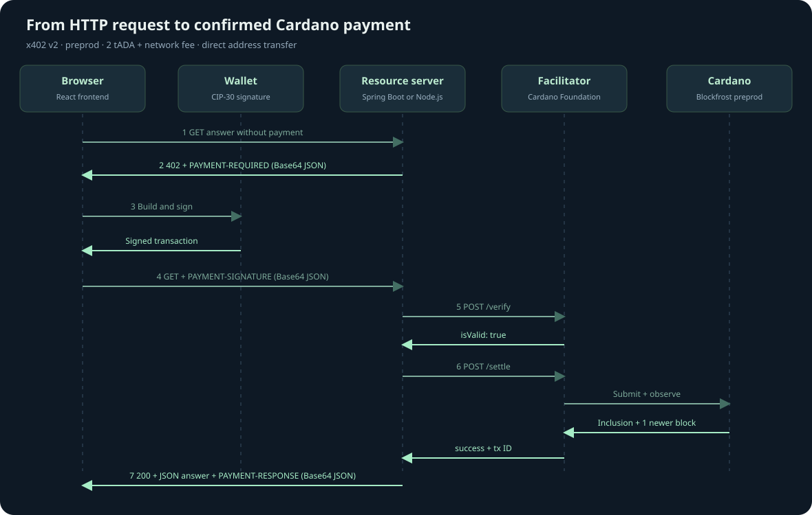

# Cardano x402 from request to paid answer

This tutorial demonstrates a complete HTTP payment handshake using test ADA on Cardano preprod. You will run a facilitator, a Spring Boot resource server, and a separate React frontend, then inspect a 402 quote and approve a payment in a CIP-30 wallet. The resource is a short local educational answer costing 2 tADA plus the network fee.



## Which parts come from x402

Read this example as three layers: the shared x402 protocol, its Cardano mechanism, and the application that sells an answer. The protocol does not prescribe Spring Boot, Express, a wallet connector, or a database.

| Part you see in this demo | Where it is defined |
| --- | --- |
| HTTP 402 with PAYMENT-REQUIRED, a paid retry with PAYMENT-SIGNATURE, and a receipt in PAYMENT-RESPONSE | Standard x402 v2 HTTP transport; each header carries Base64-encoded JSON. |
| x402Version, resource, accepts, and the selected accepted requirements | Standard x402 v2 message schemas. |
| scheme, network, asset, amount, payTo, maxTimeoutSeconds, and extra | Standard requirements fields; each mechanism interprets its asset and extra values. |
| /supported, /verify, /settle, isValid, success, transaction, and network | Standard facilitator contract. |
| Signed Cardano CBOR transaction, input-reference nonce, lovelace, and Cardano transfer methods | Cardano exact mechanism. |
| POST /api/quotes, question UUIDs, PostgreSQL ownership, session storage, price 2 tADA, and the fresh-quote buttons | This application's design. |

The first four rows follow the [core v2 specification](https://github.com/x402-foundation/x402/blob/6323ec74c85607e706e0722dd294365a7fb57768/specs/x402-specification-v2.md) and [HTTP transport specification](https://github.com/x402-foundation/x402/blob/6323ec74c85607e706e0722dd294365a7fb57768/specs/transports-v2/http.md). These links pin the source revision used by the facilitator's SDK 2.26.0 compatibility target. Later protocol versions may add capabilities.

The JSON body copied alongside the 402 header is a convenience for inspection. The canonical HTTP payment information is in the headers. Our 202 pending response and 410 quote-expired response, including paymentStatus and canRequestNewQuote, are application recovery decisions; they are not additional standard x402 headers or schemas.

## What each application does

The **frontend** asks for an answer and shows the protocol messages. CF Connect with Wallet discovers browser wallets and manages the connection. Evolution builds a Cardano transaction and asks the CIP-30 wallet to sign it. The official x402 Cardano client turns that result into a payment payload; the official core library encodes it as an HTTP header.

The **resource server** owns the price and receiving address. It issues the HTTP 402 challenge, compares the returned payment to its stored terms, and calls the facilitator. It releases the answer only after sufficient settlement evidence. It stores each question and its payment in PostgreSQL so a transaction cannot purchase a different question on retry.

The **facilitator** verifies the signed payment, broadcasts it, and checks the chain through Blockfrost. It holds no signing keys. The payer wallet supplies both the resource price and network fee. These roles follow the [CF facilitator API](https://github.com/cardano-foundation/cardano-x402-facilitator/blob/97add9f/docs/api.md) and [official Cardano x402 mechanism](https://github.com/x402-foundation/x402/tree/6323ec74c85607e706e0722dd294365a7fb57768/typescript/packages/mechanisms/cardano).

## Prepare your environment

1. Start Docker Desktop. The CF facilitator uses Linux AMD64 because its pinned native Aiken binding requires that platform. On Apple Silicon, Docker runs that container through emulation.
2. Run `./scripts/setup.sh`. It installs locked frontend dependencies, imports the preprod key from `~/keys` when needed, and generates a merchant wallet if `PAY_TO` is empty. The merchant recovery phrase stays in `.local/merchant.json` with restricted permissions.
3. Run `./scripts/start.sh`. The initial build downloads dependencies and runs server tests plus the facilitator's native derivation checks.
4. Run `./scripts/check.sh` after startup. It checks live facilitator readiness, the chain proxy, the 402 header, frontend routing, and malformed-payment rejection without spending funds.
5. Open `http://localhost:5174` in the browser with your wallet extension installed.

Spring Boot is the default resource server. To run the optional JavaScript implementation instead, use `./scripts/start.sh js`. It replaces only the resource-server container; the frontend, facilitator, merchant configuration, database, and port 8081 stay the same. Use `./scripts/start.sh java` to switch back. Stop either variant with `docker compose stop`.

Install a CIP-30 wallet from its official source, select **preprod** in its settings, and obtain test ADA from the [official faucet](https://docs.cardano.org/cardano-testnets/tools/faucet/). The merchant and facilitator do not need starting funds. A wallet with at least 3 tADA can pay this demo price and fee, subject to the wallet's UTxO layout.

CIP-30 reports network ID `0` for both preview and preprod. The frontend can reject mainnet, but it cannot distinguish those two testnets from that value alone. Select preprod explicitly. The builder and facilitator use preprod data.

## Step 1 Ask without payment

Enter a question such as “What is a UTxO?” and press **Ask and see the 402 quote**. The frontend first creates a question record with `POST /api/quotes`. That free setup endpoint returns a unique resource URL. It then requests that URL without a payment:

```http
GET /api/answers/{quoteId}
```

The server responds with **HTTP 402 Payment Required**, a `PAYMENT-REQUIRED` header, and the same JSON in the response body. The header is base64-encoded JSON, not encryption. The trace panel decodes it for inspection.

```json
{
  "x402Version": 2,
  "resource": {
    "url": "http://localhost:8081/api/answers/{quoteId}",
    "description": "A short educational Cardano answer",
    "mimeType": "application/json"
  },
  "accepts": [{
    "scheme": "exact",
    "network": "cardano:preprod",
    "asset": "lovelace",
    "amount": "2000000",
    "payTo": "addr_test1...",
    "maxTimeoutSeconds": 600,
    "extra": {
      "assetTransferMethod": "default",
      "areFeesSponsored": false,
      "confirmationPolicy": { "l1Confirmations": 1 }
    }
  }]
}
```

An ADA is 1,000,000 lovelace. The price is therefore 2 test ADA, expressed as an integer string. The **default** transfer method sends value directly to the merchant address. The quote expires after 10 minutes; the UI shows a countdown and offers **Request a fresh quote** in the final 30 seconds. The transaction's validity window is capped to finish before the quote expires.

## Step 2 Connect and approve in the wallet

Connect one of the installed wallets. The wallet permission prompt permits the site to read account information and request signatures. It does not transfer funds.

Press **Approve 2 tADA in wallet**. The browser checks the quote against its configured price, recipient, resource URL, network, and confirmation policy. The Evolution adapter builds a transaction with a merchant output, a network fee, and change back to the payer.

Review the receiving address, test ADA amount, change, and fee in your wallet, then approve the signature. The chosen UTxO is included in the transaction inputs and recorded as the nonce `previousTxHash#outputIndex`. This provides an on-chain replay anchor. The browser never calls `submitTx`; the signed transaction is still unbroadcast at this step.

The adapter implements `ClientCardanoSigner` because the SDK's reference signer uses a mnemonic, while this demo signs through a browser wallet. The official `ExactCardanoScheme` constructs the Cardano payload, and `encodePaymentSignatureHeader` from `@x402/core/http` creates the header.

## Step 3 Retry with the signed payment

The frontend saves the signed payload in this tab's session storage before sending it. It repeats the same request with a `PAYMENT-SIGNATURE` header:

```http
GET /api/answers/{quoteId}
PAYMENT-SIGNATURE: <base64 x402 v2 payment payload>
```

The decoded payload contains `x402Version`, `resource`, `accepted`, and `payload`. Cardano's inner payload contains the signed transaction as base64 CBOR and the nonce. The resource server requires the `accepted` terms to match its stored quote and the resource URL to identify that question.

The outer message follows x402 v2; the transaction and nonce are Cardano-specific. The browser-wallet connection uses CIP-30, a separate Cardano standard. CF Connect with Wallet and our Evolution adapter are implementation choices: another client can create the same x402 payment without using React or a browser extension.

Spring Boot calls `POST /verify` on the facilitator. **HTTP 200 from verify is not enough:** the server checks `isValid: true`. On rejection, it returns 402 and never calls settlement. On acceptance, it computes the Cardano transaction ID from the original transaction body and binds that ID to the question in PostgreSQL before submission.

## Step 4 Submit and observe settlement

Spring Boot calls `POST /settle` using the verified payload and the original terms. The facilitator validates, submits once, and waits for chain evidence. Its PostgreSQL journal lets it reconcile a retry after a restart or lost HTTP response.

This demo uses `l1Confirmations: 1`: the payment must appear in a canonical block and at least one newer block must follow. Mempool acceptance is insufficient. Confirmation time varies; the facilitator waits up to 75 seconds per call, while the server gives that call 90 seconds.

If evidence is still pending, the resource server returns **HTTP 202**, a `PAYMENT-RESPONSE` header, and the transaction ID. Press **Check the same payment again** after a short wait. A network timeout may also happen after submission, so keep the original signed payment even if you have not received a transaction ID.

Do not sign a second transaction for the same question after a payment may have been submitted. The retry reconciles the existing payment without another signature or another broadcast. Refreshing the same tab restores the saved payment. Closing the tab removes that browser copy; the server still retains the payment journal.

If a wallet approval takes longer than the quote lifetime, the server can return **410 quote_expired** before accepting that payment. For an unbound quote it also returns `paymentStatus: not_submitted` and `canRequestNewQuote: true`. Only this explicit pre-submission rejection, or a verification rejection with the same guarantee, lets the frontend discard the saved signature and offer **Request a fresh quote**. Expiration does not stop reconciliation of an already accepted payment. Pending responses and network failures retain the signature.

## Step 5 Read the answer and receipt

After sufficient chain evidence, the server returns **HTTP 200**, the answer, and `PAYMENT-RESPONSE` containing the settlement receipt. The frontend displays the answer and a preprod transaction explorer link. Open the link to inspect the merchant output and fee independently.

Retrying this same question with the same payment returns its saved answer. Reusing that transaction for a different question returns **409 Conflict**, enforced by a unique Cardano transaction ID in the resource database. Transaction submission idempotency alone does not provide this resource-level binding.

## Payment types supported on Cardano

Separate the **scheme** (the payment agreement), **asset** (what is paid), and **assetTransferMethod** (how it moves). The pinned Cardano SDK and CF facilitator implement the **exact** scheme. The broader x402 repository also defines other schemes, but this starter does not provide Cardano upto, batch settlement, or recurring billing.

The [Cardano exact specification](https://github.com/x402-foundation/x402/blob/6323ec74c85607e706e0722dd294365a7fb57768/specs/schemes/exact/scheme_exact_cardano.md) defines these three transfer methods under the same scheme:

| extra.assetTransferMethod | What the payment does | Used by this starter |
| --- | --- | --- |
| default | Sends the quoted asset to the merchant address. | Yes: direct 2 tADA payment. |
| masumi | Locks funds in the Masumi vested_pay escrow against seller-signed terms and a defined lock datum. Settlement proves the lock, not payout to the seller. Later release, result, refund, and dispute transactions are outside this x402 purchase. | No: requires escrow quote issuance and lifecycle tooling. |
| script | Locks funds at a server-defined script address. The server supplies the script/hash, parameters, and any required datum; the facilitator checks the address binding, not arbitrary datum semantics. | No: requires a contract-specific builder and lifecycle. |

These are Cardano mechanism semantics, not optional decorative x402 extensions. Masumi's escrow transfer method also does not mean selecting the generic x402 escrow payment-flow model. The pinned SDK declares authorization for all three methods.

The [official Cardano SDK documentation](https://github.com/x402-foundation/x402/blob/6323ec74c85607e706e0722dd294365a7fb57768/typescript/packages/mechanisms/cardano/README.md) describes ADA and native-token support. ADA uses asset lovelace, with amount expressed in lovelace. A native token uses asset `<policyIdHex>.<assetNameHex>` and an integer amount in its smallest unit. A fungible stablecoin such as USDM is a native-token payment; its asset identity is network-specific. Token outputs still need sufficient ADA for minimum UTxO value, and the payer supplies ADA for fees.

The mechanism recognizes cardano:mainnet, cardano:preprod, and cardano:preview. A facilitator serves only its configured networks. This repository configures preprod, and both resource servers and the browser adapter deliberately accept only lovelace with direct transfers. Changing only the asset string will not add token, escrow, or script support to this frontend.

For Masumi experiments, read the SDK's **Relationship to masumi-payment-service** section: its seller authorization differs from that service's signature format, so the pinned SDK's locks need x402-aware lifecycle tooling.

## Fees and settlement evidence

The bundled [facilitator API](https://github.com/cardano-foundation/cardano-x402-facilitator/blob/97add9f/docs/api.md) advertises the supported transfer methods, fee policy, and confirmation range through GET /supported. Check this endpoint when choosing a policy; SDK support alone does not establish a running facilitator's capabilities. Fee sponsorship is not supported by this pinned Cardano mechanism: areFeesSponsored is false and the payer signs a complete transaction including fees.

| l1Confirmations | Evidence needed for success |
| --- | --- |
| -1 | Facilitator's broadcast acceptance; requires explicit operator opt-in. |
| 0 | Canonical block inclusion. |
| 1 through 20 | Inclusion plus that many newer canonical blocks, within the advertised range. |

This demo requests 1 and releases no answer on mempool acceptance. The confirmation count measures observed chain depth, not irreversible finality. These Cardano policy details are separate from the standard x402 success and transaction receipt fields.

## How the resource servers control access

The Spring Boot controller reads PAYMENT-SIGNATURE and calls PaidAnswers.answer. That service performs the payment gate explicitly; there is no global payment filter on every endpoint. It builds the v2 envelope itself and delegates chain validation to the CF facilitator.

The optional JavaScript implementation uses Express with the official server-side packages:

```js
import { HTTPFacilitatorClient, x402ResourceServer } from '@x402/core/server';
import { ExactCardanoScheme } from '@x402/cardano/exact/server';

const facilitator = new HTTPFacilitatorClient({
  url: facilitatorUrl,
  timeoutMs: 90_000,
});
const payments = new x402ResourceServer(facilitator)
  .register('cardano:preprod', new ExactCardanoScheme());
await payments.initialize();
```

The SDK queries /supported, parses the explicit lovelace price, validates selected Cardano capabilities, builds the requirements and 402 envelope, and runs verifyPayment and settlePayment. Official core HTTP helpers encode and decode all three payment headers. Our code supplies the Express routes, question records, expiration policy, transaction ownership, and answer logic. We use the core server API directly so durable retries can bypass fresh verification of already-spent inputs.

```js
const verified = await payments.verifyPayment(incoming, row.requirements);
// Reject isValid: false; otherwise prepare the local answer and persist the binding.
const settled = await payments.settlePayment(incoming, row.requirements);
// Release the prepared answer only on success with the expected hash and depth.
```

These excerpts omit the surrounding checks; read resource-server-js/src/answers.mjs for the complete gate. Core retries a transaction-carrying settlement_pending result once automatically. If it remains pending, our route returns 202 and retains the exact payload for the browser's next retry. PostgreSQL holds the binding before submission; a session advisory lock coordinates JavaScript retries for the same quote.

The Cardano SDK describes authorization ordering as **verify → resource handler → settle → response**. JavaScript follows this ordering by preparing its pure local answer before settlement, then publishing it only after confirmation. Spring Boot currently generates its answer after settlement. That is a deliberate difference in the demo's business-handler timing, not a new Cardano paymentFlow. For a fallible or costly resource, prepare it after verification and before charging, and make its work recoverable across retries. See the [Cardano mechanism payment flow](https://github.com/x402-foundation/x402/blob/6323ec74c85607e706e0722dd294365a7fb57768/specs/schemes/exact/scheme_exact_cardano.md#payment-flow).

SDK 2.26.0 omits extra.assetTransferMethod when its resolved method is default. Spring Boot emits default explicitly. Both select the same Cardano method; the frontend accepts both encodings while refusing masumi and script. The server always compares the payer's accepted object to the exact requirements it stored.

## Inspect the implementation

| File | Responsibility |
| --- | --- |
| `frontend/src/payment.ts` | Offer checks, Evolution CIP-30 signer, official x402 payload and header |
| `frontend/src/App.tsx` | Wallet connection, quote, trace, signing, and retry UI |
| `resource-server/src/main/java/demo/x402/PaidAnswers.java` | Quote persistence, v2 handshake, payment ownership, answer release |
| `resource-server/src/main/java/demo/x402/FacilitatorClient.java` | Facilitator supported, verify, and settle HTTP calls |
| `resource-server/src/main/java/demo/x402/BlockfrostProxy.java` | Restricted chain reads with the private Blockfrost key |
| `resource-server-js/src/sdk.mjs` | Official JavaScript resource server, Cardano scheme registration, facilitator client |
| `resource-server-js/src/answers.mjs` | SDK payment calls, immutable quotes, answer preparation and release |
| `resource-server-js/src/store.mjs` | Shared PostgreSQL journal and per-quote JavaScript coordination |
| `compose.javascript.yaml` | Optional JavaScript resource-server override |
| `compose.yaml` | Separate applications and durable PostgreSQL volume |

At the compatibility revision used here, the official Java x402 library documents a v1 filter using `X-PAYMENT` and a different requirements shape. This example implements a small v2 transport adapter in Spring Boot; it does not use that v1 filter. See the [pinned official Java README](https://github.com/x402-foundation/x402/blob/6323ec74c85607e706e0722dd294365a7fb57768/java/README.md). The optional JavaScript server uses the official v2 packages directly.

## Common issues

| Symptom | Action |
| --- | --- |
| No wallet appears | Open the page in the browser where the CIP-30 extension is installed, then reload. |
| Wrong network or unavailable inputs | Select preprod explicitly; preview also reports CIP-30 network ID 0. |
| No spendable UTxOs or insufficient funds | Fund the payer with preprod test ADA and wait for wallet and Blockfrost indexing. |
| Expired quote before signing | Press Request a fresh quote. |
| Expired quote after a slow wallet approval | Retry the saved payment; when the server confirms it was not submitted, press Request a fresh quote. |
| Pending or lost response after signing | Retry the same saved payment. Do not request another signature. |
| Backend unavailable | Check `docker compose logs --tail=100 facilitator resource-server` and facilitator readiness. |
| Chain authorization failure | Set a valid preprod Blockfrost token in `.env` and recreate the services. |

Run `./scripts/test.sh` for the automated checks. Run `./scripts/check.sh` for the live no-spend smoke test. See [validation evidence](validation.md) for what was actually exercised and what still requires a funded wallet.
