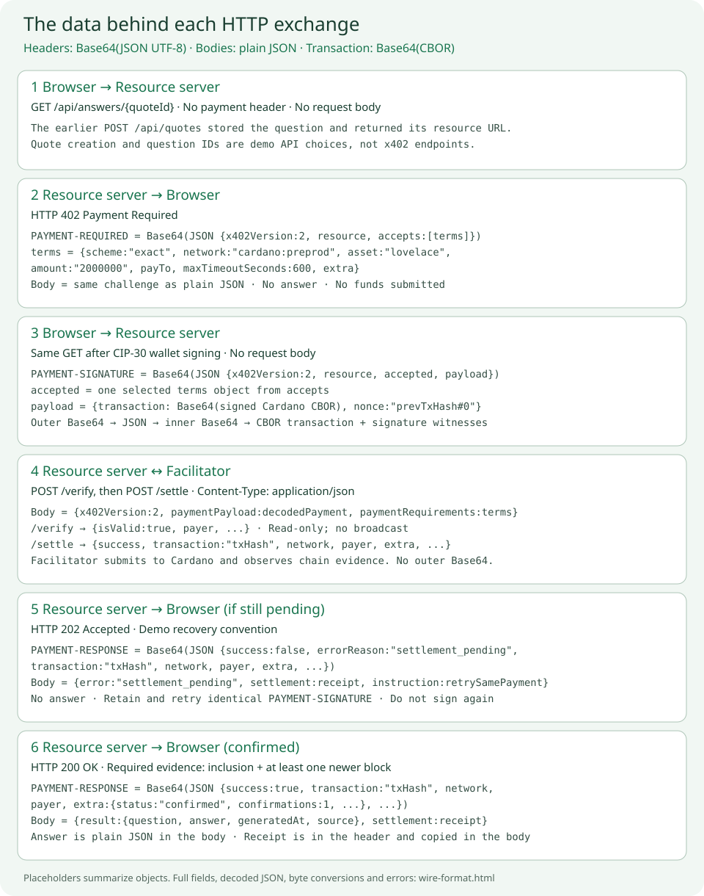

# HTTP messages and encoding

Follow the actual data exchanged by this starter, from an unpaid request to a paid answer. Both resource servers expose this flow on port 8081. The JSON below is illustrative: `{quoteId}`, `addr_test1...`, `{txHash}`, and `<base64 signed CBOR>` stand for runtime values, not a payment you can submit. Object key order and whitespace can differ without changing the decoded meaning.



[Open the message illustration at full size](images/http-messages.svg). The [tutorial](tutorial.md) explains how to run the example and approve the wallet payment.

## What travels in a header versus a body

| Exchange | HTTP header | Decoded header object | HTTP body in this starter |
| --- | --- | --- | --- |
| Unpaid resource response: 402 | PAYMENT-REQUIRED | PaymentRequired: x402Version, resource, accepts | The same challenge as ordinary JSON. No answer. |
| Paid retry: GET | PAYMENT-SIGNATURE | PaymentPayload: x402Version, resource, accepted, payload | No request body. |
| Pending response: 202 | PAYMENT-RESPONSE | SettlementResponse with success false and errorReason settlement_pending | error, settlement, and retry instruction as ordinary JSON. No answer. |
| Paid resource response: 200 | PAYMENT-RESPONSE | SettlementResponse with success true and transaction ID | result and settlement as ordinary JSON. |
| Server calls facilitator: POST /verify or /settle | Content-Type: application/json | No x402 payment header is needed for these facilitator calls. | x402Version, paymentPayload, paymentRequirements as ordinary JSON. |

The three payment header names and their Base64 JSON envelopes come from the [x402 v2 HTTP transport](https://github.com/x402-foundation/x402/blob/6323ec74c85607e706e0722dd294365a7fb57768/specs/transports-v2/http.md). Response bodies are chosen by the application. The 202 response, duplicated challenge/receipt bodies, and quote creation endpoint are demo conventions. Cardano's transaction, nonce, transfer method, and confirmation evidence follow the [Cardano exact mechanism](https://github.com/x402-foundation/x402/blob/6323ec74c85607e706e0722dd294365a7fb57768/specs/schemes/exact/scheme_exact_cardano.md).

## 0 Create the question record

This free endpoint belongs to the demo, not to x402. It stores the question and payment terms, checks facilitator capabilities, and gives the browser a resource URL.

```http
POST /api/quotes HTTP/1.1
Host: localhost:8081
Content-Type: application/json

{"question":"What is a UTxO?"}
```

```http
HTTP/1.1 200 OK
Content-Type: application/json

{"id":"{quoteId}","url":"http://localhost:8081/api/answers/{quoteId}","expiresAt":1791190200000}
```

`expiresAt` is the demo's absolute expiry time in milliseconds since the Unix epoch. The server generates it as now plus 600 seconds. It is not a field in the standard PaymentRequired envelope.

## 1 The resource server returns 402

```http
GET /api/answers/{quoteId} HTTP/1.1
Host: localhost:8081
```

```http
HTTP/1.1 402 Payment Required
Content-Type: application/json
PAYMENT-REQUIRED: <Base64 of the UTF-8 JSON challenge below>
```

The header decodes to this object. For the initial unpaid request, this starter also puts the object directly in the JSON response body:

```json
{
  "x402Version": 2,
  "resource": {
    "url": "http://localhost:8081/api/answers/{quoteId}",
    "description": "A short educational Cardano answer",
    "mimeType": "application/json"
  },
  "accepts": [
    {
      "scheme": "exact",
      "network": "cardano:preprod",
      "asset": "lovelace",
      "amount": "2000000",
      "payTo": "addr_test1...",
      "maxTimeoutSeconds": 600,
      "extra": {
        "assetTransferMethod": "default",
        "areFeesSponsored": false,
        "confirmationPolicy": { "l1Confirmations": 1 }
      }
    }
  ]
}
```

| Field | What the browser learns |
| --- | --- |
| x402Version | Interpret the envelope as x402 v2. |
| resource | Which URL the payment buys, its description, and the response media type. |
| accepts | Available payment options. This starter offers exactly one. |
| scheme | exact: pay the quoted quantity using the Cardano exact mechanism. |
| network | Use Cardano preprod, not a different chain or testnet. |
| asset | lovelace, Cardano's smallest ADA unit. |
| amount | Integer string in asset base units: 2000000 lovelace is 2 tADA. |
| payTo | Merchant receiving address; it is a public payment destination. |
| maxTimeoutSeconds | Payment time budget; this demo also stores a 10-minute quote expiry. |
| extra.assetTransferMethod | default means a direct transfer to the merchant address. |
| extra.areFeesSponsored | false: the payer funds the network fee in addition to the price. |
| extra.confirmationPolicy | Require block inclusion and at least one newer block in this demo. |

No transaction has been built or submitted. `accepts` contains payment terms, not the requested answer.

## 2 The wallet signs and the browser retries

The browser selects one option from `accepts`, builds a transaction using wallet UTxOs, and requests a CIP-30 signature. CIP-30 signing returns witnesses; the adapter assembles the full signed transaction with its body and witness set. It encodes those CBOR bytes as Base64 in `payload.transaction`. The browser does not broadcast it.

The retry carries one outer Base64 JSON header and no request body:

```http
GET /api/answers/{quoteId} HTTP/1.1
Host: localhost:8081
PAYMENT-SIGNATURE: <Base64 of the UTF-8 payment JSON below>
```

```json
{
  "x402Version": 2,
  "resource": {
    "url": "http://localhost:8081/api/answers/{quoteId}",
    "description": "A short educational Cardano answer",
    "mimeType": "application/json"
  },
  "accepted": {
    "scheme": "exact",
    "network": "cardano:preprod",
    "asset": "lovelace",
    "amount": "2000000",
    "payTo": "addr_test1...",
    "maxTimeoutSeconds": 600,
    "extra": {
      "assetTransferMethod": "default",
      "areFeesSponsored": false,
      "confirmationPolicy": { "l1Confirmations": 1 }
    }
  },
  "payload": {
    "transaction": "<base64 signed CBOR>",
    "nonce": "{previousTxHash}#0"
  }
}
```

`accepted` is the selected requirements object, not the whole `accepts` array. The resource server compares it to its stored quote and checks the resource URL. The nonce names one transaction input using its previous transaction hash and output index; it is not a random token or the new payment's transaction ID. The facilitator checks that the nonce input is consumed and authorized.

Despite the name PAYMENT-SIGNATURE, the header carries a complete payment envelope. The actual Cardano signatures are in the transaction's CBOR witness set. It contains no wallet mnemonic or private key.

## 3 The server verifies and settles using plain JSON

The resource server decodes the header and sends a JSON request to the facilitator. The complete objects shown above replace the placeholders here:

```javascript
const facilitatorRequest = {
  x402Version: 2,
  paymentPayload: decodedPaymentSignature,
  paymentRequirements: storedQuoteRequirements
};
// POST /verify, then POST /settle, each with Content-Type: application/json
// Body: JSON.stringify(facilitatorRequest)
```

The facilitator HTTP API uses ordinary JSON. The server does not forward the outer Base64 header string as its request body. The inner `paymentPayload.payload.transaction` stays Base64 CBOR because JSON cannot directly carry binary transaction bytes.

The facilitator omits null fields from its JSON. A successful `/verify` response looks like:

```json
{"isValid":true,"payer":"addr_test1..."}
```

Verification checks the signed transaction against the requirements and current chain state. It does not submit the transaction. HTTP 200 is the facilitator API's response status; the resource server must still inspect `isValid`. After a valid verdict, it durably binds the canonical Cardano transaction ID to this question before calling `/settle` with the same payment and requirements.

`/settle` is the submission and observation step. A pending response looks like:

```json
{
  "success": false,
  "errorReason": "settlement_pending",
  "payer": "addr_test1...",
  "transaction": "{txHash}",
  "network": "cardano:preprod",
  "extra": { "status": "pending", "transactionId": "{txHash}" }
}
```

The facilitator can add `extra.confirmations` when it has inclusion evidence; -1 means mempool-only observation and 0 means included with no newer block. A successful response is shown in the next step. The `extra` evidence is Cardano-specific; `success`, `transaction`, and `network` are part of the shared settlement envelope. The transaction ID is a 64-character hexadecimal hash of the transaction body, not Base64 and not a hash of the entire PAYMENT-SIGNATURE header.

## 4 Pending and successful resource responses

If settlement is still pending, the resource server returns:

```http
HTTP/1.1 202 Accepted
Content-Type: application/json
PAYMENT-RESPONSE: <Base64 of the pending settlement JSON above>

{"error":"settlement_pending","settlement":{...},"instruction":"Retry the identical PAYMENT-SIGNATURE; do not sign another transaction."}
```

`{...}` abbreviates the full pending settlement object. This body is an application response, and 202 is this starter's recovery convention. The browser retains its signed payment and repeats the same GET with the identical PAYMENT-SIGNATURE; it does not build another payment.

Once the required evidence exists, the server returns:

```http
HTTP/1.1 200 OK
Content-Type: application/json
PAYMENT-RESPONSE: <Base64 of the successful settlement JSON below>
```

Decoded PAYMENT-RESPONSE:

```json
{
  "success": true,
  "payer": "addr_test1...",
  "transaction": "{txHash}",
  "network": "cardano:preprod",
  "extra": {
    "status": "confirmed",
    "transactionId": "{txHash}",
    "confirmations": 1
  }
}
```

The body is ordinary JSON with the purchased resource and a copy of that receipt:

```json
{
  "result": {
    "question": "What is a UTxO?",
    "answer": "A UTxO is an unspent transaction output: a piece of value controlled by an address. A Cardano payment consumes existing UTxOs and creates new outputs for the merchant and your change. The x402 nonce identifies one consumed input.",
    "generatedAt": "2026-10-05T10:00:00Z",
    "source": "Local educational examples; no external AI service"
  },
  "settlement": {
    "success": true,
    "payer": "addr_test1...",
    "transaction": "{txHash}",
    "network": "cardano:preprod",
    "extra": {
      "status": "confirmed",
      "transactionId": "{txHash}",
      "confirmations": 1
    }
  }
}
```

This answer text matches the Spring Boot example; JavaScript returns its own equivalent educational wording. The frontend reads `result.answer` for display and decodes the receipt for its protocol trace. The receipt records payment settlement, not the question's answer. The whole response body is not Base64 encoded.

## 5 Decode the bytes yourself

All three headers follow this outer transformation:

```text
JSON object → JSON text → UTF-8 bytes → standard Base64 → HTTP header
HTTP header → Base64 decode → UTF-8 text → JSON parse → JSON object
```

Cardano's inner transaction has another transformation:

```text
Signed Cardano transaction → CBOR bytes → Base64 → payload.transaction
Decode PAYMENT-SIGNATURE first → parse JSON → decode payload.transaction → CBOR bytes
```

JSON and CBOR are serialization formats. Base64 is a text encoding, not encryption, compression, or a digital signature. The JSON envelope is readable by anyone who has the header. Changes to serialized JSON can change its Base64 spelling without changing its meaning; changes to transaction witnesses do not necessarily change the transaction body ID. A valid wallet signature and facilitator verification establish payment validity.

In Node.js, a tiny independent example shows the exact transformation:

```javascript
const example = { x402Version: 2 };
const header = Buffer.from(JSON.stringify(example), 'utf8').toString('base64');
console.log(header); // eyJ4NDAyVmVyc2lvbiI6Mn0=
const decoded = JSON.parse(Buffer.from(header, 'base64').toString('utf8'));
console.log(decoded); // { x402Version: 2 }
```

For real payments, use the official library rather than this miniature example:

```javascript
import {
  decodePaymentRequiredHeader,
  encodePaymentSignatureHeader,
  decodePaymentResponseHeader
} from '@x402/core/http';

const required = decodePaymentRequiredHeader(response402.headers.get('PAYMENT-REQUIRED'));
const signature = encodePaymentSignatureHeader(paymentPayload);
const receipt = decodePaymentResponseHeader(response200.headers.get('PAYMENT-RESPONSE'));
```

To inspect a real 402 without signing or spending, start the demo and run this with Node.js 22 or newer. It prints the exact Base64 header, the decoded JSON, and the plain JSON body:

```javascript
const base = 'http://localhost:8081';
const created = await fetch(`${base}/api/quotes`, {
  method: 'POST',
  headers: { 'Content-Type': 'application/json' },
  body: JSON.stringify({ question: 'What is a UTxO?' })
});
if (!created.ok) throw new Error(`Quote creation failed: ${created.status}`);
const quote = await created.json();
const response = await fetch(`${base}/api/answers/${quote.id}`);
if (response.status !== 402) throw new Error(`Expected 402, got ${response.status}`);
const raw = response.headers.get('PAYMENT-REQUIRED');
console.log('Status:', response.status);
console.log('Header:', raw);
console.log('Decoded:', JSON.parse(Buffer.from(raw, 'base64').toString('utf8')));
console.log('Body:', await response.json());
```

Save it as `inspect-402.mjs` and run `node inspect-402.mjs`. This probes whichever resource-server variant is running. A full Base64 header changes with the generated quote ID and merchant address, so the examples above use descriptive placeholders instead of a stale header.

In the browser, fetch reads a JSON body with `await response.json()`. To inspect a header without the SDK, `JSON.parse(new TextDecoder().decode(Uint8Array.from(atob(header), c => c.charCodeAt(0))))` preserves UTF-8 correctly. `atob` alone returns a binary string, not parsed JSON. The default frontend proxies `/api` through its own origin. A separate cross-origin client would also need CORS permission to send PAYMENT-SIGNATURE and expose PAYMENT-REQUIRED and PAYMENT-RESPONSE to browser JavaScript.

## 6 Rejections and recovery data

| Condition | Status and data returned by this starter | Next action |
| --- | --- | --- |
| Facilitator verification rejected | 402, PAYMENT-REQUIRED challenge, body error payment_invalid plus verification verdict, paymentStatus not_submitted, canRequestNewQuote true | Inspect invalidReason and resolve it before requesting new terms. This body differs from the initial unpaid 402. No settlement call happened. |
| Expired quote with no bound payment | 410, body error quote_expired, paymentStatus not_submitted, canRequestNewQuote true, instruction | The server explicitly permits a fresh quote; no payment was submitted for it. |
| Invalid envelope or mismatched terms | 400, body error malformed_payment or payment_terms_mismatch | Inspect the payload. These responses do not advertise a replacement-payment guarantee. |
| Payment header too large | 413, body error payment_too_large | The server limits the header to 60,000 characters. |
| Transaction already belongs to another question | 409, body error payment_already_used_for_another_question | A transaction cannot buy two different questions. |
| Same quote, different transaction | 409, body error quote_already_bound_to_another_payment | Reconcile the original bound payment. |
| Other settlement failure | 409, PAYMENT-RESPONSE receipt and error/settlement/instruction body | Inspect the evidence; retain the original payment rather than automatically signing again. |
| Resource server backend unavailable | 503, body error backend_unavailable and instruction | A lost response can follow submission; retain and retry the same signed payment. |
| Unknown quote ID | 404, body error quote_not_found | Check the resource URL. |

These error codes, safety flags, and retry instructions are application behavior. The [architecture guide](architecture.md#payment-states-and-retries) describes the persisted ownership and recovery model. The illustration summarizes the normal exchange; this table covers alternate paths.

## Where this is implemented

- [PaidAnswers.java](https://github.com/satran004/cardano-x402-starter/blob/main/resource-server/src/main/java/demo/x402/PaidAnswers.java): creates the challenge, decodes the paid header, enforces stored terms and ownership, and encodes response headers.
- [FacilitatorClient.java](https://github.com/satran004/cardano-x402-starter/blob/main/resource-server/src/main/java/demo/x402/FacilitatorClient.java): sends decoded objects to /verify and /settle as JSON.
- [answers.mjs](https://github.com/satran004/cardano-x402-starter/blob/main/resource-server-js/src/answers.mjs): equivalent request gate using official SDK header helpers.
- [payment.ts](https://github.com/satran004/cardano-x402-starter/blob/main/frontend/src/payment.ts): assembles signed CBOR, Base64-encodes the transaction, and creates the outer PAYMENT-SIGNATURE header.
- [App.tsx](https://github.com/satran004/cardano-x402-starter/blob/main/frontend/src/App.tsx): decodes payment requirements and receipts, reads JSON answer bodies, and retains pending payments.
